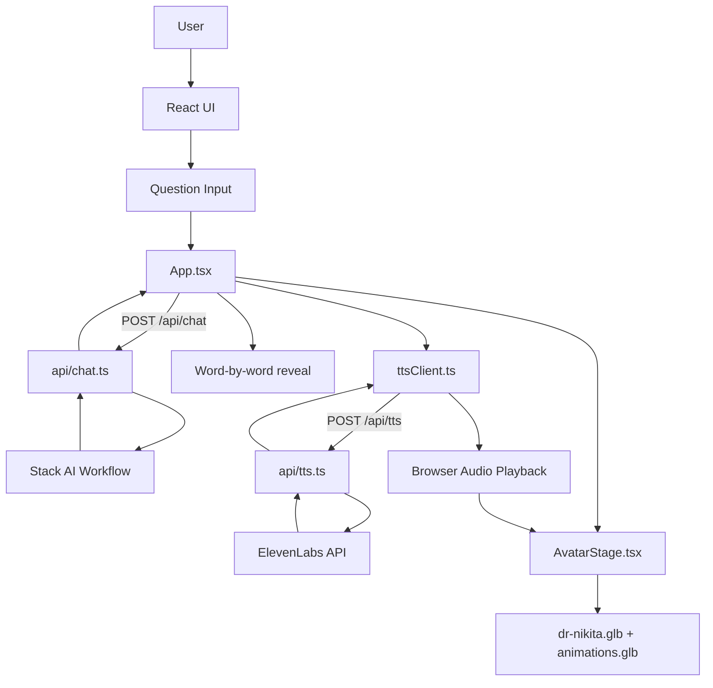

# Productica AI — Dr. Nikita Avatar

Project structure and architecture reference for the **Dr.Nikita Avatar** application.

---

## 1. Project Overview

| Item | Details |
|---|---|
| **Project name** | `dr-nikita-mentor` |
| **Product** | Productica AI |
| **Purpose** | AI mentor chat with a 3D speaking avatar |
| **Mentor** | Dr. Nikita Vadsaria — Startup & Innovation Mentor |
| **Type** | Full-stack web app (React frontend + serverless API) |
| **Deployment target** | Vercel |

---

## 2. Tech Stack

| Layer | Technology |
|---|---|
| **Frontend** | React 19 + TypeScript |
| **Build tool** | Vite 6 |
| **Styling** | Tailwind CSS 4 |
| **3D Avatar** | Three.js + React Three Fiber + Drei |
| **AI responses** | Stack AI workflow (external API) |
| **Text-to-speech** | ElevenLabs API (Rachel voice) |
| **Backend** | Vercel serverless functions (`api/`) |
| **Local dev API** | Vite middleware plugins in `vite.config.ts` |

---

## 3. Folder Structure

```text
Dr.Nikita Avatar/
│
├── api/                          # Backend (Vercel serverless API routes)
│   ├── chat.ts                   # POST /api/chat → Stack AI mentor replies
│   ├── stackAi.ts                # Shared Stack AI workflow caller
│   └── tts.ts                    # POST /api/tts → ElevenLabs speech audio
│
├── public/                       # Static assets served directly
│   ├── avatar/
│   │   ├── dr-nikita.glb         # Main 3D avatar model (used in app)
│   │   └── README.txt
│   ├── animations.glb            # Extra gesture/teaching animations
│   └── vite.svg
│
├── src/                          # Frontend source code
│   ├── main.tsx                  # React app entry point
│   ├── App.tsx                   # Main app logic (chat + speech + avatar state)
│   ├── index.css                 # Global styles / Tailwind
│   ├── types.ts                  # Shared TypeScript types
│   ├── vite-env.d.ts
│   │
│   ├── components/               # UI components
│   │   ├── AvatarStage.tsx       # 3D avatar canvas + animations
│   │   ├── ChatWindow.tsx        # Chat panel container
│   │   ├── ChatMessage.tsx       # Single chat bubble
│   │   ├── Header.tsx            # Top bar (Productica AI)
│   │   ├── MentorIdentityCard.tsx# Mentor name, role, bio
│   │   ├── SpecialtyPills.tsx    # Topic tags (Fundraising, etc.)
│   │   ├── SuggestedTopics.tsx   # Quick-start question chips
│   │   ├── QuestionInput.tsx     # User input box
│   │   ├── NewSessionButton.tsx  # Reset chat session
│   │   └── Icons.tsx             # SVG icons
│   │
│   ├── data/
│   │   └── mentorProfile.ts      # Mentor profile, topics, opening message
│   │
│   └── lib/                      # Client-side utilities
│       ├── stackAiClient.ts      # Calls /api/chat from frontend
│       ├── stackAiResponse.ts    # Parses Stack AI response format
│       ├── ttsClient.ts          # Calls /api/tts, chunks text, preconnect
│       └── revealMessage.ts      # Word-by-word text reveal animation
│
├── animations.glb                # Source animation file (copy also in public/)
├── model (8).glb                 # Extra/unused model assets
├── model (9).glb
│
├── index.html                    # HTML shell
├── vite.config.ts                # Vite config + local dev API middleware
├── vercel.json                   # Vercel routing for API
├── package.json                  # Dependencies & scripts
├── tsconfig.json                 # TypeScript config
├── tsconfig.app.json
├── tsconfig.node.json
├── .env                          # Secrets (not committed)
├── .env.example                  # Env variable template
└── .gitignore
```

---

## 4. Architecture Flow



### Step-by-step user flow

1. User types a question or picks a suggested topic.
2. `App.tsx` sends it to `/api/chat`.
3. Backend calls **Stack AI** and returns mentor text.
4. Text is revealed word-by-word in chat.
5. In parallel, text is sent to `/api/tts`.
6. **ElevenLabs** returns audio (Rachel voice).
7. Avatar enters **speaking** state and plays audio.
8. Avatar uses 3D model + animation clips from `animations.glb`.

---

## 5. Key Files Explained

### Frontend core

| File | Role |
|---|---|
| `src/main.tsx` | Boots React app |
| `src/App.tsx` | Main state machine: chat, thinking, speaking, session reset |
| `src/types.ts` | `ChatMessage`, `AvatarState`, error messages |
| `src/data/mentorProfile.ts` | Mentor identity, specialties, suggested topics |

### UI components

| File | Role |
|---|---|
| `ChatWindow.tsx` | Chat area + input + suggested topics |
| `ChatMessage.tsx` | Renders user/mentor/error bubbles |
| `AvatarStage.tsx` | 3D canvas, avatar model, idle/speaking animations |
| `MentorIdentityCard.tsx` | Mentor bio card |
| `SuggestedTopics.tsx` | One-click starter questions |

### Client libraries

| File | Role |
|---|---|
| `stackAiClient.ts` | Frontend wrapper for `/api/chat` |
| `stackAiResponse.ts` | Extracts `out-0` / output from Stack AI JSON |
| `ttsClient.ts` | Chunks text, preconnects ElevenLabs, fetches audio |
| `revealMessage.ts` | Types out mentor reply word-by-word |

### Backend API

| File | Endpoint | Role |
|---|---|---|
| `api/chat.ts` | `POST /api/chat` | Sends user message to Stack AI |
| `api/stackAi.ts` | (shared) | Stack AI HTTP call logic |
| `api/tts.ts` | `POST /api/tts` | Converts text to speech via ElevenLabs |

### Config

| File | Role |
|---|---|
| `vite.config.ts` | React + Tailwind + local dev APIs for chat & TTS |
| `vercel.json` | API route rewrites for production |
| `.env` | API keys and workflow URL |

---

## 6. Environment Variables

Copy `.env.example` to `.env` and fill in values:

```env
STACKAI_API_KEY=...          # Stack AI auth key
STACKAI_FLOW_URL=...         # Stack AI workflow inference URL
ELEVENLABS_API_KEY=...       # ElevenLabs TTS key
ELEVENLABS_VOICE_ID=21m00Tcm4TlvDq8ikWAM   # Rachel voice
```

---

## 7. External Services

| Service | Used for |
|---|---|
| **Stack AI** | Mentor intelligence / answer generation |
| **ElevenLabs** | Female voice (Rachel) for avatar speech |
| **Vercel** | Hosting frontend + API in production |

---

## 8. NPM Scripts

| Command | What it does |
|---|---|
| `npm install` | Install dependencies |
| `npm run dev` | Start frontend + local API (Vite) |
| `npm run build` | Type-check + production build |
| `npm run preview` | Preview production build |
| `npm run lint` | Run ESLint |

### Start the app (development)

```powershell
cd "C:\Users\jadha\OneDrive\Desktop\Dr.Nikita Avatar"
npm install
npm run dev
```

Open the URL shown in the terminal (usually `http://localhost:5173/`).

For production-like API behavior, use `npx vercel dev` instead (do not run both at once).

---

## 9. Dev vs Production

| Mode | How APIs run |
|---|---|
| **Development** (`npm run dev`) | Vite middleware in `vite.config.ts` serves `/api/chat` and `/api/tts` |
| **Production** (Vercel) | Serverless functions in `api/` folder |

---

## 10. 3D Assets

| File | Purpose |
|---|---|
| `public/avatar/dr-nikita.glb` | Main avatar body model |
| `public/animations.glb` | Teaching/speaking gesture animations |
| `model (8).glb`, `model (9).glb` | Extra models (not actively used in app) |

---

## 11. App Layout (UI Structure)

```text
┌─────────────────────────────────────────────────────────────┐
│  Header — Productica AI                    Mentor Online   │
├──────────────────────────────┬──────────────────────────────┤
│  LEFT PANEL                  │  RIGHT PANEL                 │
│  ├── MentorIdentityCard      │  ├── AvatarStage (3D)        │
│  ├── SpecialtyPills          │  │   └── Speaking animation  │
│  └── ChatWindow              │  └── Mentor name badge         │
│      ├── Chat messages       │                              │
│      ├── Suggested topics    │                              │
│      └── Question input      │                              │
├──────────────────────────────┴──────────────────────────────┤
│  New Session button                                          │
└─────────────────────────────────────────────────────────────┘
```

---

## 12. State Management (in `App.tsx`)

| State | Purpose |
|---|---|
| `messages` | Chat history |
| `isThinking` | Waiting for Stack AI reply |
| `isSpeaking` | Avatar is talking |
| `avatarState` | `idle` / `thinking` / `speaking` |
| `showSuggestedTopics` | Show/hide starter chips |
| `sessionIdRef` | Reset support for new session |

---

## 13. Mentor Knowledge Domains

Dr. Nikita is scoped to advise on:

- Strategic partnerships
- Fundraising and investor strategy
- Startup scaling
- Research commercialization
- Accelerator readiness
- Business model review
- Startup ecosystem strategy

Mentor persona and topics are defined in `src/data/mentorProfile.ts`. Detailed answer content comes from the **Stack AI workflow** configured via `STACKAI_FLOW_URL`.

---

## 14. API Endpoints

### `POST /api/chat`

**Request body:**

```json
{
  "message": "Am I accelerator-ready?",
  "userId": "user-uuid"
}
```

**Response:**

```json
{
  "reply": "Mentor response text..."
}
```

### `POST /api/tts`

**Request body:**

```json
{
  "text": "Text to speak aloud"
}
```

**Response:** `audio/mpeg` binary stream
